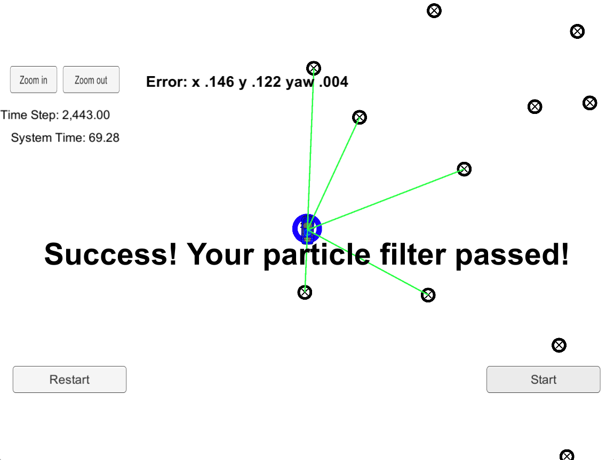

# Overview
This repository contains all the code needed to complete the Kidnapped Vehicle project for Udacity's Self-Driving Car Nanodegree.

#### Submission
Files modified:
- particle_filter.h
- particle_filter.cpp

#### Sample runs in simulator

